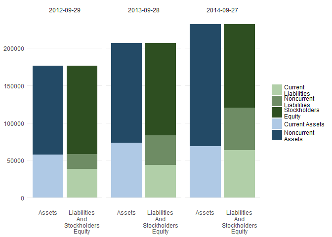
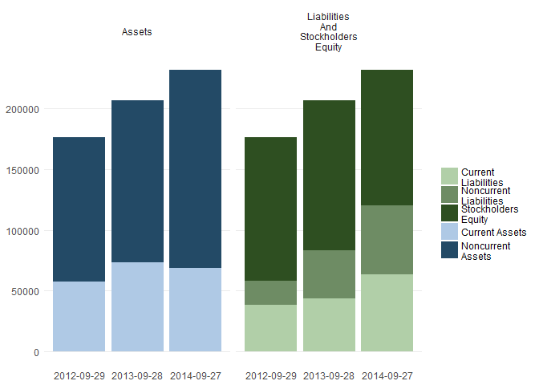
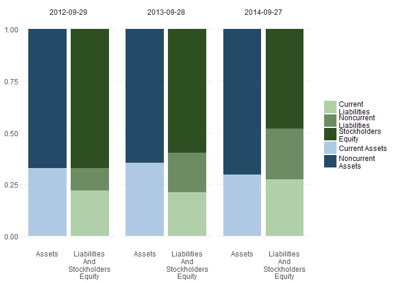

finstr
======

The purpose of **finstr** package is to create an environment for reproducible financial statement analysis. The package will not cover specific types of analysis (except in examples and package vignettes) but will provide a domain language to write them. With other functions in basic R and existing R packages it anables users to store, share, reuse and reproduce the results of their analitic work.

For now it is offering:

**1. Data structure for financial statements**

-   Reading from data parsed with XBRL package
-   Statements in tidy format with accounting taxonomy concepts as columns
-   Encapsulates calculation hierarchy of variables
-   Default printing in transposed format and with visible hierarchy

**2. Statement calculation validation**

-   Calculation of higher order elements
-   Check if calculated values match original values

**3. Merge statements**

-   Merge different periods of equal statement type
-   Merge statements of a different type

**4. Calculate and reveal**

-   Custom financial ratio calculations definitions
-   Exposing data by rearranging the statament hierarchy
-   Time lagged difference

Install finstr
--------------

To install finstr from github use install\_github from devtools package:

``` r
library(devtools)
install_github("bergant/finstr")
```

Get data
--------

Use XBRL package to parse XBRL files. For example:

``` r
library(XBRL)
# parse XBRL (Apple 10-K report)
xbrl_url2014 <- 
  "http://edgar.sec.gov/Archives/edgar/data/320193/000119312514383437/aapl-20140927.xml"
xbrl_url2013 <- 
  "http://edgar.sec.gov/Archives/edgar/data/320193/000119312513416534/aapl-20130928.xml"
old_o <- options(stringsAsFactors = FALSE)
xbrl_data_aapl2014 <- xbrlDoAll(xbrl_url2014)
xbrl_data_aapl2013 <- xbrlDoAll(xbrl_url2013)
options(old_o)
```

Prepare statements
------------------

With `xbrl_get_statements` convert XBRL data to *statements* object.

``` r
library(finstr)

st2013 <- xbrl_get_statements(xbrl_data_aapl2013)
st2014 <- xbrl_get_statements(xbrl_data_aapl2014)
st2014
#> Financial statements repository
#>                                              From         To Rows Columns
#> StatementOfIncome                      2012-09-29 2014-09-27    3      15
#> StatementOfOtherComprehensiveIncome    2012-09-29 2014-09-27    3      14
#> StatementOfFinancialPositionClassified 2013-09-28 2014-09-27    2      33
#> StatementOfCashFlowsIndirect           2012-09-29 2014-09-27    3      33
```

Statements object is a list of several statement objects (ballance sheets, income and cash flow statements).

To get a single *statement* use *statements* object as a regular R list:

``` r
balance_sheet2013 <- st2013$StatementOfFinancialPositionClassified
balance_sheet2014 <- st2014$StatementOfFinancialPositionClassified
income2013 <- st2013$StatementOfIncome
income2014 <- st2014$StatementOfIncome
balance_sheet2014
#> Financial statement: 2 observations from 2013-09-28 to 2014-09-27 
#>  Element                                             2014-09-27 2013-09-28
#>  Assets =                                            231839     207000    
#>  + AssetsCurrent =                                    68531      73286    
#>    + CashAndCashEquivalentsAtCarryingValue            13844      14259    
#>    + AvailableForSaleSecuritiesCurrent                11233      26287    
#>    + AccountsReceivableNetCurrent                     17460      13102    
#>    + InventoryNet                                      2111       1764    
#>    + DeferredTaxAssetsNetCurrent                       4318       3453    
#>    + NontradeReceivablesCurrent                        9759       7539    
#>    + OtherAssetsCurrent                                9806       6882    
#>  + AvailableForSaleSecuritiesNoncurrent              130162     106215    
#>  + PropertyPlantAndEquipmentNet                       20624      16597    
#>  + Goodwill                                            4616       1577    
#>  + IntangibleAssetsNetExcludingGoodwill                4142       4179    
#>  + OtherAssetsNoncurrent                               3764       5146    
#>  LiabilitiesAndStockholdersEquity =                  231839     207000    
#>  + Liabilities =                                     120292      83451    
#>    + LiabilitiesCurrent =                             63448      43658    
#>      + AccountsPayableCurrent                         30196      22367    
#>      + AccruedLiabilitiesCurrent                      18453      13856    
#>      + DeferredRevenueCurrent                          8491       7435    
#>      + CommercialPaper                                 6308          0    
#>    + DeferredRevenueNoncurrent                         3031       2625    
#>    + LongTermDebt                                     28987      16960    
#>    + OtherLiabilitiesNoncurrent                       24826      20208    
#>  + CommitmentsAndContingencies                            0          0    
#>  + StockholdersEquity =                              111547     123549    
#>    + CommonStocksIncludingAdditionalPaidInCapital     23313      19764    
#>    + RetainedEarningsAccumulatedDeficit               87152     104256    
#>    + AccumulatedOtherComprehensiveIncomeLossNetOfTax   1082       -471
tail(income2014, 2)
#> Financial statement: 2 observations from 2013-09-28 to 2014-09-27 
#>  Element                                          2014-09-27 2013-09-28
#>  NetIncomeLoss =                                   39510      37037    
#>  + IncomeLossFromContinuingOperationsBefore... =   53483      50155    
#>    + OperatingIncomeLoss =                         52503      48999    
#>      + GrossProfit =                               70537      64304    
#>        + SalesRevenueNet                          182795     170910    
#>        - CostOfGoodsAndServicesSold               112258     106606    
#>      - OperatingExpenses =                         18034      15305    
#>        + ResearchAndDevelopmentExpense              6041       4475    
#>        + SellingGeneralAndAdministrativeExpense    11993      10830    
#>    + NonoperatingIncomeExpense                       980       1156    
#>  - IncomeTaxExpenseBenefit                         13973      13118
```

Validate statement calculation hierarchy
----------------------------------------

Recalculate higher order concepts from basic values and check for errors.

``` r
check <- check_statement(balance_sheet2014)
check
#> Number of errors:  0 
#> Number of elements in errors:  0
```

In case of error the numbers with errors will be presented along with elements:

``` r
check_statement(
  within(balance_sheet2014, InventoryNet <- InventoryNet * 2)
)
#> Number of errors:  2 
#> Number of elements in errors:  1 
#> 
#> Element: AssetsCurrent  =  + CashAndCashEquivalentsAtCarryingValue + AvailableForSaleSecuritiesCurrent + AccountsReceivableNetCurrent + InventoryNet + DeferredTaxAssetsNetCurrent + NontradeReceivablesCurrent + OtherAssetsCurrent 
#>         date   original calculated      error
#> 3 2013-09-28 7.3286e+10 7.5050e+10 -1.764e+09
#> 4 2014-09-27 6.8531e+10 7.0642e+10 -2.111e+09
```

Validation returns all calculation results in a readable data frame. Lets check only operating income from income statement:

``` r
check <- check_statement(income2014, element_id = "OperatingIncomeLoss")
check
#> Number of errors:  0 
#> Number of elements in errors:  0
check$expression[1]
#> [1] "+ GrossProfit - OperatingExpenses"
check$calculated / 10^6
#> [1] 55241 48999 52503
```

Merge statements from different periods
---------------------------------------

Use `merge` function to create single financial statement data from two statements.

``` r
balance_sheet <- merge( balance_sheet2013, balance_sheet2014 )
```

The structure of merged balance sheets may differ if XBRL taxonomy changes. Function `merge` takes care of it by expanding the elements hierarchy to fit both statements. The values of any missing elements in different periods is set to 0.

To merge all statements from *statements* object use merge on statements objects:

``` r
# merge all statements
st_all <- merge( st2013, st2014 )
# check if balance sheets are merged:
balance_sheet <- st_all$StatementOfFinancialPositionClassified
balance_sheet$endDate
#> [1] "2012-09-29" "2013-09-28" "2014-09-27"
```

Merge different types of statements
-----------------------------------

If there are no matching elements between the two statements `merge` joins statements by matching their periods. For some financial ratio calculations the combined statement may be
a better starting point.

``` r
  merge.statement(
    st_all$StatementOfFinancialPositionClassified, 
    st_all$StatementOfIncome )
```

Calculate financial ratios
--------------------------

Statement object (in our case `balance_sheet`) is also a data frame object with statement elements as columns and time periods as rows. It is possible then to use statement as a data frame.

Lets calculate current ratio which is defined by

\[ Current Ratio = \frac{Current Assets}{Current Liabilities} \]

With dplyr package we can use `mutate`, `select` or `transmute` functions:

``` r
library(dplyr)

balance_sheet %>% transmute(
  date = endDate, 
  CurrentRatio = AssetsCurrent / LiabilitiesCurrent
)
#>         date CurrentRatio
#> 1 2012-09-29     1.495849
#> 2 2013-09-28     1.678639
#> 3 2014-09-27     1.080113
```

By using `finstr::calculate` function we can achieve the same result but don't have to handle the date field and there is a rounding parameter. Lets calculate for example two ratios:

``` r

balance_sheet %>% calculate( digits = 2,
  
    Current_Ratio = AssetsCurrent / LiabilitiesCurrent,
    
    Quick_Ratio =  
      ( CashAndCashEquivalentsAtCarryingValue + 
          AvailableForSaleSecuritiesCurrent +
          AccountsReceivableNetCurrent
        ) / LiabilitiesCurrent
    
)
#>         date Current_Ratio Quick_Ratio
#> 1 2012-09-29          1.50        1.04
#> 2 2013-09-28          1.68        1.23
#> 3 2014-09-27          1.08        0.67
```

If we need a period average value we can use a `lag` function. For example, to calculate *DSO* (days sales outstanding) over longer periods the average of account receivable is compared to net sales.

We will use the formula for yearly preiods:

\[ DSO = \frac{Average Accounts Receivable}{Sales Revenue} \times 365 \]

In this case we need to connect two type of statements: balance sheets and income statements. With matching reporting periods it can be accomplished with joining two data frames:

``` r

merge(balance_sheet, st_all$StatementOfIncome ) %>% calculate( digits = 2,
                                                               
    .AccountReceivableLast = lag(AccountsReceivableNetCurrent),
    .AccountReceivableAvg = (.AccountReceivableLast + AccountsReceivableNetCurrent)/2,
    
    DaysSalesOutstanding = .AccountReceivableAvg / SalesRevenueNet * 365 
  )
#>         date DaysSalesOutstanding
#> 1 2012-09-29                   NA
#> 2 2013-09-28                25.66
#> 3 2014-09-27                30.51
```

The leading dot instructs the calculate function to hide the value. In our case only DaysSalesOutstanding is selected in final result. Use `digits` parameter to control rounding.

Reusing calculations
--------------------

When running same calculation for different statements, define the calculation with `calculation` and call `calculate` with argument `calculations`:

``` r
# define calculation
profit_margins <- calculation(
  
  Gross_Margin = 
    (SalesRevenueNet -  CostOfGoodsAndServicesSold) / SalesRevenueNet,
  
  Operating_Margin =
    OperatingIncomeLoss / SalesRevenueNet,
  
  Net_Margin = 
    NetIncomeLoss / SalesRevenueNet
  
)

# run profit margins for two different statements
income2013 %>% calculate(calculations = profit_margins, digits = 2)
#>         date Gross_Margin Operating_Margin Net_Margin
#> 1 2011-09-24         0.40             0.31       0.24
#> 2 2012-09-29         0.44             0.35       0.27
#> 3 2013-09-28         0.38             0.29       0.22
income2014 %>% calculate(calculations = profit_margins, digits = 2)
#>         date Gross_Margin Operating_Margin Net_Margin
#> 1 2012-09-29         0.44             0.35       0.27
#> 2 2013-09-28         0.38             0.29       0.22
#> 3 2014-09-27         0.39             0.29       0.22
```

Rearranging statement hierarchy
-------------------------------

Calculations gives us freedom to use any formula with any data from financial statements. Most of the time this is not necessary as we can get useful information just by regrouping calculation hierarchy.

There are many additional reasons why is rearranging statements useful step before actual calculations:

-   We can avoid errors in formulas with many variables
-   Accounting taxonomies do change and using many formulas on original statement is harder to support than using custom hierarchy for analysis starting point
-   When sharing analysis it is much easier to print 6 values instead of 30

To rearrange the statement to simple 2-level hierarchy use `expose` function.

``` r
expose( balance_sheet,
  
  # Assets
  `Current Assets` = "AssetsCurrent",
  `Noncurrent Assets` = other("Assets"),

  # Liabilites and equity
  `Current Liabilities` = "LiabilitiesCurrent",
  `Noncurrent Liabilities` = other(c("Liabilities", "CommitmentsAndContingencies")),
  `Stockholders Equity` = "StockholdersEquity"
)
#> Financial statement: 3 observations from 2012-09-29 to 2014-09-27 
#>  Element                             2014-09-27 2013-09-28 2012-09-29
#>  Assets =                            231839     207000     176064    
#>  + Current.Assets                     68531      73286      57653    
#>  + Noncurrent.Assets                 163308     133714     118411    
#>  LiabilitiesAndStockholdersEquity =  231839     207000     176064    
#>  + Current.Liabilities                63448      43658      38542    
#>  + Noncurrent.Liabilities             56844      39793      19312    
#>  + Stockholders.Equity               111547     123549     118210
```

Balance sheet stays divided by *Assets* and *Liabilities and Equity*. For the second level we are exposing *current assets* from *noncurrent* and similar is done for the *liabilities*. We choose to separate *equity*.

Function `expose` expects a list of vectors with element names. Function `other` helps us identify elements without enumerating every single element. Using `other` reduces a lot of potential errors as the function "knows" which elements are not specified and keeps the balance sheet complete.

Sometimes it is easier to define a complement than a list of elements. In this case we can use the `%without%` operator. Lets expose for example *tangible* and then *intangible* assets:

``` r
expose( balance_sheet,
  
  # Assets
  `Tangible Assets` = 
    "Assets" %without% c("Goodwill", "IntangibleAssetsNetExcludingGoodwill"),
  `Intangible Assets` = other("Assets"),

  # Liabilites and equity
  `Liabilities` = c("Liabilities", "CommitmentsAndContingencies"),
  `Stockholders Equity` = "StockholdersEquity"
)
#> Financial statement: 3 observations from 2012-09-29 to 2014-09-27 
#>  Element                             2014-09-27 2013-09-28 2012-09-29
#>  Assets =                            231839     207000     176064    
#>  + Tangible.Assets                   223081     201244     170705    
#>  + Intangible.Assets                   8758       5756       5359    
#>  LiabilitiesAndStockholdersEquity =  231839     207000     176064    
#>  + Liabilities                       120292      83451      57854    
#>  + Stockholders.Equity               111547     123549     118210
```

Lagged difference
-----------------

To calculate lagged difference for entire statement use `diff` function. The result is statement of changes between successive years:

``` r

diff(balance_sheet)
#> Financial statement: 2 observations from 2013-09-28 to 2014-09-27 
#>  Element                                             2014-09-27 2013-09-28
#>  Assets =                                             24839      30936    
#>  + AssetsCurrent =                                    -4755      15633    
#>    + CashAndCashEquivalentsAtCarryingValue             -415       3513    
#>    + AvailableForSaleSecuritiesCurrent               -15054       7904    
#>    + AccountsReceivableNetCurrent                      4358       2172    
#>    + InventoryNet                                       347        973    
#>    + DeferredTaxAssetsNetCurrent                        865        870    
#>    + NontradeReceivablesCurrent                        2220       -223    
#>    + OtherAssetsCurrent                                2924        424    
#>  + AvailableForSaleSecuritiesNoncurrent               23947      14093    
#>  + PropertyPlantAndEquipmentNet                        4027       1145    
#>  + Goodwill                                            3039        442    
#>  + IntangibleAssetsNetExcludingGoodwill                 -37        -45    
#>  + OtherAssetsNoncurrent                              -1382       -332    
#>  LiabilitiesAndStockholdersEquity =                   24839      30936    
#>  + Liabilities =                                      36841      25597    
#>    + LiabilitiesCurrent =                             19790       5116    
#>      + AccountsPayableCurrent                          7829       1192    
#>      + AccruedLiabilitiesCurrent                       4597       2442    
#>      + DeferredRevenueCurrent                          1056       1482    
#>      + CommercialPaper                                 6308          0    
#>    + DeferredRevenueNoncurrent                          406        -23    
#>    + LongTermDebt                                     12027      16960    
#>    + OtherLiabilitiesNoncurrent                        4618       3544    
#>  + CommitmentsAndContingencies                            0          0    
#>  + StockholdersEquity =                              -12002       5339    
#>    + CommonStockValue                                     0     -16422    
#>    + RetainedEarningsAccumulatedDeficit              -17104       2967    
#>    + AccumulatedOtherComprehensiveIncomeLossNetOfTax   1553       -970    
#>    + CommonStocksIncludingAdditionalPaidInCapital      3549      19764
```

Balance sheet visualization
===========================

Prepare custom hierarchy
------------------------

The only way to visualize a balance sheet is by exposing a limited number of values. The first step is then to aggregate a balance sheet by selected concepts. We can use `expose` to specify these groups of elements. For example:

``` r
bs_simple <- expose( balance_sheet,
  
  # Assets
  `Current Assets` = "AssetsCurrent",
  `Noncurrent Assets` = other("Assets"),
  # Liabilites and equity
  `Current Liabilities` = "LiabilitiesCurrent",
  `Noncurrent Liabilities` = other(c("Liabilities", "CommitmentsAndContingencies")),
  `Stockholders Equity` = "StockholdersEquity"
)
```

Print as a table
----------------

``` r
library(htmlTable)
print(bs_simple, html = TRUE, big.mark = ",", dateFormat = "%Y")
```

<table class="gmisc_table" style="border-collapse: collapse;">
<thead>
<tr>
<th style="border-bottom: 1px solid grey; border-top: 2px solid grey;">
</th>
<th style="border-bottom: 1px solid grey; border-top: 2px solid grey; text-align: center;">
2014
</th>
<th style="border-bottom: 1px solid grey; border-top: 2px solid grey; text-align: center;">
2013
</th>
<th style="border-bottom: 1px solid grey; border-top: 2px solid grey; text-align: center;">
2012
</th>
</tr>
</thead>
<tbody>
<tr>
<td style="text-align: left;">
<strong>Assets</strong>
</td>
<td style="text-align: right;">
<strong>231,839</strong>
</td>
<td style="text-align: right;">
<strong>207,000</strong>
</td>
<td style="text-align: right;">
<strong>176,064</strong>
</td>
</tr>
<tr>
<td style="text-align: left;">
   Current Assets
</td>
<td style="text-align: right;">
68,531
</td>
<td style="text-align: right;">
73,286
</td>
<td style="text-align: right;">
57,653
</td>
</tr>
<tr>
<td style="text-align: left;">
   Noncurrent Assets
</td>
<td style="text-align: right;">
163,308
</td>
<td style="text-align: right;">
133,714
</td>
<td style="text-align: right;">
118,411
</td>
</tr>
<tr>
<td style="text-align: left;">
<strong>Liabilities And Stockholders Equity</strong>
</td>
<td style="text-align: right;">
<strong>231,839</strong>
</td>
<td style="text-align: right;">
<strong>207,000</strong>
</td>
<td style="text-align: right;">
<strong>176,064</strong>
</td>
</tr>
<tr>
<td style="text-align: left;">
   Current Liabilities
</td>
<td style="text-align: right;">
63,448
</td>
<td style="text-align: right;">
43,658
</td>
<td style="text-align: right;">
38,542
</td>
</tr>
<tr>
<td style="text-align: left;">
   Noncurrent Liabilities
</td>
<td style="text-align: right;">
56,844
</td>
<td style="text-align: right;">
39,793
</td>
<td style="text-align: right;">
19,312
</td>
</tr>
<tr>
<td style="border-bottom: 2px solid grey; text-align: left;">
   Stockholders Equity
</td>
<td style="border-bottom: 2px solid grey; text-align: right;">
111,547
</td>
<td style="border-bottom: 2px solid grey; text-align: right;">
123,549
</td>
<td style="border-bottom: 2px solid grey; text-align: right;">
118,210
</td>
</tr>
</tbody>
</table>
Double stacked graph
--------------------

Using ggplot2 package we can plot a simplified balance sheet:

``` r
library(ggplot2)

plot_double_stacked_bar(bs_simple)
```



Another option is to group by faceting balance sheet side instead of date:

``` r

plot_double_stacked_bar(bs_simple, by_date = FALSE)
```



Using **proportional** form we reveal the changes in balance sheet structure:

``` r

bs_simple_prop <- proportional(bs_simple)
plot_double_stacked_bar(bs_simple_prop)
```


