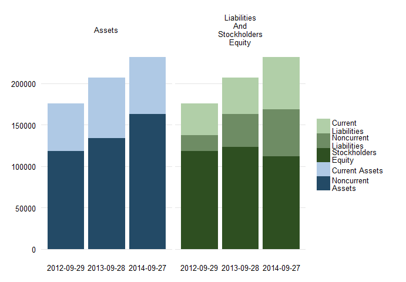
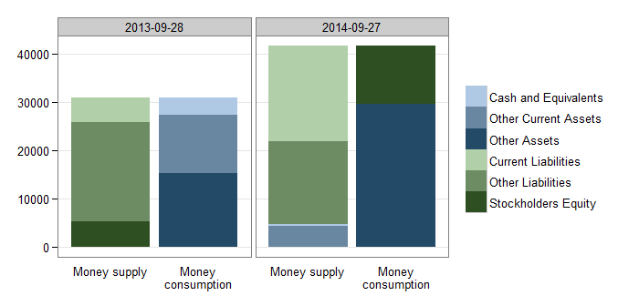

**Warning: finstr package is in development. Please use with caution.**

The purpose of finstr package is to use financial statements data in more structured form and process. For now it is offering:

1.  Data structure for financial statements in tidy and usable format
2.  Validation of statement calculation
3.  Function to merge two reporting periods into single object
4.  Calculations on statements data and lagged difference calculation

The idea in long term is to create an environment for reproducible financial statement analysis. With existing packages like XBRL for XBRL parsing, dplyr for data manipulation and knitr for reproducible research, this shouldn't be a long journey.

Install finstr
--------------

finstr is not on CRAN. You have to install it from github.

``` {.r}
library(devtools)
install_github("bergant/finstr")
```

Get data
--------

Use XBRL package to parse XBRL files. For example:

``` {.r}
library(XBRL)
# parse XBRL (Apple 10-K report)
xbrl_url2014 <- 
  "http://edgar.sec.gov/Archives/edgar/data/320193/000119312514383437/aapl-20140927.xml"
xbrl_url2013 <- 
  "http://edgar.sec.gov/Archives/edgar/data/320193/000119312513416534/aapl-20130928.xml"
xbrl_data_aapl2014 <- xbrlDoAll(xbrl_url2014)
xbrl_data_aapl2013 <- xbrlDoAll(xbrl_url2013)
```

Prepare statements
------------------

With `xbrl_get_statements` convert XBRL data to *statements* object.

``` {.r}
library(finstr)

st2013 <- xbrl_get_statements(xbrl_data_aapl2013)
st2014 <- xbrl_get_statements(xbrl_data_aapl2014)
st2014
#> Financial statements repository
#>                                              From         To Rows Columns
#> StatementOfIncome                      2012-09-29 2014-09-27    3      15
#> StatementOfOtherComprehensiveIncome    2012-09-29 2014-09-27    3      14
#> StatementOfFinancialPositionClassified 2013-09-28 2014-09-27    2      33
#> StatementOfCashFlowsIndirect           2012-09-29 2014-09-27    3      33
```

Statements object is a list of several statement objects (ballance sheets, income and cash flow statements) which are data frames with elements as columns and periods as rows. To get a single *statement* use *statements* object as a regular R list:

``` {.r}
balance_sheet2013 <- st2013$StatementOfFinancialPositionClassified
balance_sheet2014 <- st2014$StatementOfFinancialPositionClassified
income2013 <- st2013$StatementOfIncome
income2014 <- st2014$StatementOfIncome
balance_sheet2014
#> Financial statement: 2 observations from 2013-09-28 to 2014-09-27 
#> Numbers in  000000 
#>                                                    2014-09-27 2013-09-28
#> Assets =                                           231839     207000    
#> + AssetsCurrent =                                   68531      73286    
#>   + CashAndCashEquivalentsAtCarryingValue           13844      14259    
#>   + AvailableForSaleSecuritiesCurrent               11233      26287    
#>   + AccountsReceivableNetCurrent                    17460      13102    
#>   + InventoryNet                                     2111       1764    
#>   + DeferredTaxAssetsNetCurrent                      4318       3453    
#>   + NontradeReceivablesCurrent                       9759       7539    
#>   + OtherAssetsCurrent                               9806       6882    
#> + AvailableForSaleSecuritiesNoncurrent             130162     106215    
#> + PropertyPlantAndEquipmentNet                      20624      16597    
#> + Goodwill                                           4616       1577    
#> + IntangibleAssetsNetExcludingGoodwill               4142       4179    
#> + OtherAssetsNoncurrent                              3764       5146    
#> LiabilitiesAndStockholdersEquity =                 231839     207000    
#> + Liabilities =                                    120292      83451    
#>   + LiabilitiesCurrent =                            63448      43658    
#>     + AccountsPayableCurrent                        30196      22367    
#>     + AccruedLiabilitiesCurrent                     18453      13856    
#>     + DeferredRevenueCurrent                         8491       7435    
#>     + CommercialPaper                                6308          0    
#>   + DeferredRevenueNoncurrent                        3031       2625    
#>   + LongTermDebt                                    28987      16960    
#>   + OtherLiabilitiesNoncurrent                      24826      20208    
#> + CommitmentsAndContingencies                           0          0    
#> + StockholdersEquity =                             111547     123549    
#>   + CommonStocksIncludingAdditionalPaidInCapital    23313      19764    
#>   + RetainedEarningsAccumulatedDeficit              87152     104256    
#>   + AccumulatedOtherComprehensiveIncomeLossNetOfTa   1082       -471
tail(income2014, 2)
#> Financial statement: 2 observations from 2013-09-28 to 2014-09-27 
#> Numbers in  000000 
#>                                                    2014-09-27 2013-09-28
#> NetIncomeLoss =                                     39510      37037    
#> + IncomeLossFromContinuingOperationsBeforeIncomeTa  53483      50155    
#>   + OperatingIncomeLoss =                           52503      48999    
#>     + GrossProfit =                                 70537      64304    
#>       + SalesRevenueNet                            182795     170910    
#>       - CostOfGoodsAndServicesSold                 112258     106606    
#>     - OperatingExpenses =                           18034      15305    
#>       + ResearchAndDevelopmentExpense                6041       4475    
#>       + SellingGeneralAndAdministrativeExpense      11993      10830    
#>   + NonoperatingIncomeExpense                         980       1156    
#> - IncomeTaxExpenseBenefitNA                         13973      13118
```

Information about hierarchical structure of elements (concepts) is stored as an attribute to the statement object.

To get more data about the concepts used in the statement call `get_elements`:

``` {.r}
bs_els <- get_elements(balance_sheet2014)
```

Elements store concept descriptions, balance attribute (debit/credit) and parent/child relationships between concepts.

Validate statement calculation hierarchy
----------------------------------------

Recalculate higher order concepts from basic values and check for errors.

``` {.r}
errors <- check_statement(balance_sheet2014)
errors
#> Number of errors:  0 
#> Number of elements in errors:  0
```

Merge statements from different periods
---------------------------------------

Use `merge` function to create single financial statement data from two statements.

``` {.r}
balance_sheet <- merge( balance_sheet2013, balance_sheet2014 )
```

The structure of merged balance sheets may differ if XBRL taxonomy changed. Function `merge` takes care of it by expanding the elements hierarchy to fit both statements. The values of any missing elements is set to 0.

To merge all statements from *statements* object use merge on statements objects:

``` {.r}
# merge all statements
st_all <- merge( st2013, st2014 )
# check if blance sheets are merged:
balance_sheet <- st_all$StatementOfFinancialPositionClassified
```

Calculate new values and ratios
-------------------------------

Statement object (in our case `balance_sheet`) is also a data frame object. With elements (or concepts) as columns and time periods as rows. It is possible then to use statement as a data frame.

Lets calculate current ratio which is defined by

\[ Current Ratio = \frac{Current Assets}{Current Liabilities} \]

``` {.r}
library(dplyr)

balance_sheet %>%
  mutate(CurrentRatio = AssetsCurrent / LiabilitiesCurrent) %>%
  select(endDate, CurrentRatio)
#>      endDate CurrentRatio
#> 1 2012-09-29     1.495849
#> 2 2013-09-28     1.678639
#> 3 2014-09-27     1.080113
```

By using `calculate` function we can achieve the same result with less verbose language. Lets calculate now two ratios:

``` {.r}
library(dplyr)

balance_sheet %>% calculate( digits = 2,
  
    Current_Ratio = AssetsCurrent / LiabilitiesCurrent,
    
    Quick_Ratio =  
      ( CashAndCashEquivalentsAtCarryingValue + 
          AvailableForSaleSecuritiesCurrent +
          AccountsReceivableNetCurrent
        ) / LiabilitiesCurrent
    
)
#>         date Current_Ratio Quick_Ratio
#> 1 2012-09-29          1.50        1.04
#> 2 2013-09-28          1.68        1.23
#> 3 2014-09-27          1.08        0.67
```

If we need a period average value we can use a `lag` function. For example, to calculate *DSO* (days sales outstanding) over longer periods the average of account receivable is compared to net sales.

We will use the formula for yearly preiods:

\[ DSO = \frac{Average Accounts Receivable}{Sales Revenue} \times 365 \]

In this case we need to connect two type of statements: balance sheets and income statements. With matching reporting periods it can be accomplished with joining two data frames:

``` {.r}

balance_sheet %>% 
  merge(st_all$StatementOfIncome) %>% 
  calculate( digits = 2,
    .AccountReceivableLast = lag(AccountsReceivableNetCurrent),
    .AccountReceivableAvg = (.AccountReceivableLast + AccountsReceivableNetCurrent)/2,
    DaysSalesOutstanding = .AccountReceivableAvg / SalesRevenueNet * 365 
  )
#>         date DaysSalesOutstanding
#> 1 2012-09-29                   NA
#> 2 2013-09-28                25.66
#> 3 2014-09-27                30.51
```

The leading dot instructs the calculate function to hide the value. In our case only DaysSalesOutstanding is selected in final result. There is also a digits parameter to control rounding.

Calculation as an object
------------------------

When running same calculation for different statements, store the calculation with `calculation` and run with `do_calculation`:

``` {.r}
# define calculation
profit_margins <- calculation( digits = 2,
  
  Gross_Margin = 
    (SalesRevenueNet -  CostOfGoodsAndServicesSold) / SalesRevenueNet,
  
  Operating_Margin =
    OperatingIncomeLoss / SalesRevenueNet,
  
  Net_Margin = 
    NetIncomeLoss / SalesRevenueNet

)

# run profit margins for two different statements
income2013 %>% do_calculation(profit_margins)
#>         date Gross_Margin Operating_Margin Net_Margin
#> 1 2011-09-24         0.40             0.31       0.24
#> 2 2012-09-29         0.44             0.35       0.27
#> 3 2013-09-28         0.38             0.29       0.22
income2014 %>% do_calculation(profit_margins)
#>         date Gross_Margin Operating_Margin Net_Margin
#> 1 2012-09-29         0.44             0.35       0.27
#> 2 2013-09-28         0.38             0.29       0.22
#> 3 2014-09-27         0.39             0.29       0.22
```

Lagged difference
-----------------

To calculate lagged difference for entire statement use `diff` function. The result is statement of changes between successive years:

``` {.r}

balance_sheet %>% diff()
#> Financial statement: 2 observations from 2013-09-28 to 2014-09-27 
#> Numbers in  000000 
#>                                                    2014-09-27 2013-09-28
#> Assets =                                            24839      30936    
#> + AssetsCurrent =                                   -4755      15633    
#>   + CashAndCashEquivalentsAtCarryingValue            -415       3513    
#>   + AvailableForSaleSecuritiesCurrent              -15054       7904    
#>   + AccountsReceivableNetCurrent                     4358       2172    
#>   + InventoryNet                                      347        973    
#>   + DeferredTaxAssetsNetCurrent                       865        870    
#>   + NontradeReceivablesCurrent                       2220       -223    
#>   + OtherAssetsCurrent                               2924        424    
#> + AvailableForSaleSecuritiesNoncurrent              23947      14093    
#> + PropertyPlantAndEquipmentNet                       4027       1145    
#> + Goodwill                                           3039        442    
#> + IntangibleAssetsNetExcludingGoodwill                -37        -45    
#> + OtherAssetsNoncurrent                             -1382       -332    
#> LiabilitiesAndStockholdersEquity =                  24839      30936    
#> + Liabilities =                                     36841      25597    
#>   + LiabilitiesCurrent =                            19790       5116    
#>     + AccountsPayableCurrent                         7829       1192    
#>     + AccruedLiabilitiesCurrent                      4597       2442    
#>     + DeferredRevenueCurrent                         1056       1482    
#>     + CommercialPaper                                6308          0    
#>   + DeferredRevenueNoncurrent                         406        -23    
#>   + LongTermDebt                                    12027      16960    
#>   + OtherLiabilitiesNoncurrent                       4618       3544    
#> + CommitmentsAndContingencies                           0          0    
#> + StockholdersEquity =                             -12002       5339    
#>   + CommonStockValue                                    0     -16422    
#>   + RetainedEarningsAccumulatedDeficit             -17104       2967    
#>   + AccumulatedOtherComprehensiveIncomeLossNetOfTa   1553       -970    
#>   + CommonStocksIncludingAdditionalPaidInCapitalNA   3549      19764
```

Balance sheet visualization
===========================

Prepare custom calculation hierarchy
------------------------------------

There is no human readable way to plot every number of the balance sheet in one graph. The only way to plot a balance sheet is to plot it several times. Each graph should have a limited number of highlited features. The first step is to break a balance sheet to a small number of pieces. We can use calculations to specify these groups of elements.

``` {.r}

two_sided_bs_calculation <- 
  list(
    "Assets" = calculation(
      "Cash and Equivalents" = CashAndCashEquivalentsAtCarryingValue,
      "Other Current Assets" = AssetsCurrent - CashAndCashEquivalentsAtCarryingValue,
      "Other Assets" = Assets - AssetsCurrent
    ),
    
    "Liabilities and Equity" = calculation(
      "Current Liabilities" = LiabilitiesCurrent,
      "Other Liabilities" =  Liabilities - LiabilitiesCurrent,
      "Stockholders Equity" = StockholdersEquity
    )
  )
```

We divided balance sheet to **Assets** and **Liabilities and Equity**. Both main groups are divided to only 3 smaller chunks (based on liquidity).

To plot the result we need to run the calculations on a balance sheet and call graph plotting function:

``` {.r}

balance_sheet %>% 
  do_calculation(two_sided_bs_calculation) %>%
  plot_double_stacked_bar()
```


Another option is to group by date and see assets close to liabilities for every year:

``` {.r}

balance_sheet %>% 
  do_calculation(two_sided_bs_calculation) %>%
  plot_double_stacked_bar(by_date = TRUE)
```



See the difference
------------------

We can use the same custom hierarchy on lagged differences.

``` {.r}

balance_sheet %>%
  diff() %>%
  do_calculation(two_sided_bs_calculation) %>%
  plot_double_stacked_bar(
    by_date = TRUE, is_diff = TRUE, 
    dif_labels = c("Money\nconsumption","Money\nsupply"))
```


